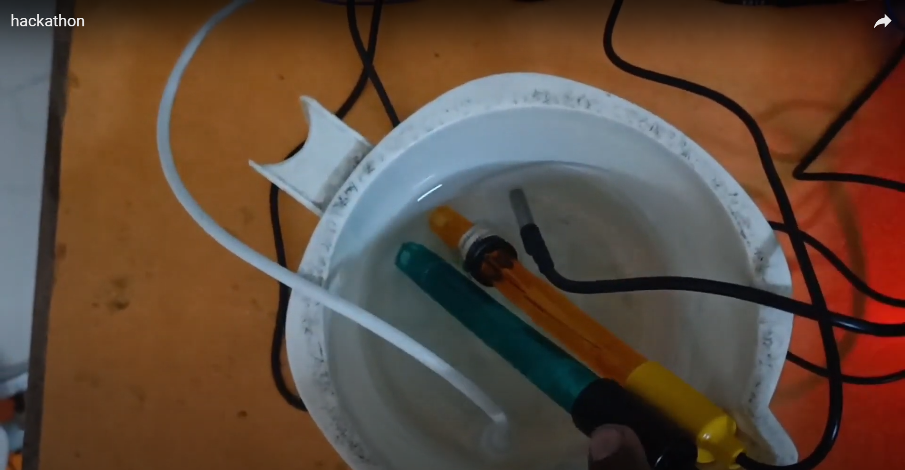

<h1 align="center" style="border-bottom: none">
    ⭐️Automating Commercial Aquaculture Using WiFi Technology⭐️  
</h1>

# [`Website link`](https://gokulrajan.netlify.app/)  
# [`Demo video link`](https://www.youtube.com/watch?v=4k6TebCr6_k) 

## Team Details
`Team number` : VH016

| Name    | Email           |
|----------------|--------------------------|
| Gokulrajan R M | goku22036.ec@rmkec.ac.in |
| Dhulasiraman M | dhul22034.ec@rmkec.ac.in |
| Gunashree R    | guna22040.ec@rmkec.ac.in |
| Madhu Mithra G | madh22082.cs@rmkec.ac.in |

    
    
    
    

## Problem statement 

 This project introduces a revolutionary, cost-effective, and scalable system designed for the real-time monitoring and management of water quality in commercial aquaculture setups. By harnessing the power of advanced sensors and WiFi technology, the system promises to maintain optimal water conditions, ensuring the health and growth of aquatic organisms and enhancing productivity and profitability in aquaculture operations. 

<h2>Table of Contents</h2>
<ul>
    <li>Introduction</li>
    <li>Features</li>
    <li>Technology Stack</li>
    <li>Installation</li>
    <li>Usage</li>
    <li>System Architecture</li>
    <li>Contributing</li>
    <li>Results</li>
    <li>Future Work</li>
    <li>License</li>
    <li>Acknowledgements</li>
</ul>

 
<h2>Introduction</h2>

In the realm of aquaculture, maintaining pristine water quality is not just a necessity—it's a critical success factor. Challenges such as stress, disease, and substantial economic losses are often the result of poor water conditions. Addressing these challenges, our project delivers an automated system capable of monitoring key water quality parameters (ORP, pH, temperature, and TDS), and facilitating timely water adjustments through automated solenoid valves and motors. Enhanced with Firebase for real-time data access and control capabilities, our system is poised to set new standards in water quality management within the aquaculture industry. 

<h2>Features</h2>

<ul>
    <li>Real-time Water Quality Monitoring</li>
    <li>Remote Access and Control</li>
    <li>Automated Water Adjustment</li>
    <li>Fish Feeding Automation</li>
    <li>User-friendly Interface</li>
</ul>

## Techstacks used 
`Data frontend` , `ESP8266 Board` , `Fish Feeding Mechanism` , `Actuators` , `Sensors`
 
 ## How to run locally 
After successfully installing and setting up the system, you can begin monitoring and managing your aquaculture water quality with ease. Here’s how to use the system effectively
 
npm install
npm start
git clone https://github.com/Gokulrajan2004/Vashisht

# What's next ?

Future enhancements will aim at incorporating advanced AI algorithms for predictive analytics...

Monitoring Water Quality
View Real-time Data: The system continuously measures water quality parameters, including ORP, pH, temperature, and TDS. This data can be viewed in real-time on the LCD display connected to the system for immediate on-site monitoring.

Remote Access: For off-site monitoring, the system's integration with Firebase allows you to access real-time data through a mobile device or computer. Log into your Firebase account and navigate to the project dashboard to view the current water quality parameters.

### Adjusting Water Conditions
Automated Adjustments: The system is designed to automatically adjust water quality when any parameter deviates from the optimal range. Solenoid valves and motors are triggered to either add new water or adjust the water composition, ensuring the environment remains ideal for aquatic life.

### Manual Override:
If you need to manually adjust water parameters, you can do so through the Firebase interface. Navigate to the control section of your dashboard, where you can open or close solenoid valves, turn motors on or off, and trigger the fish feeding mechanism.

### Feeding Fish
Automated Feeding Schedule: The servo motor-driven feeding mechanism is programmed to release feed at predetermined intervals. This schedule can be adjusted according to the specific needs of the aquatic organisms being farmed.

### Manual Feeding:
For manual feeding, access the feeding controls through the Firebase dashboard. Here, you can trigger an immediate feed release or adjust the feeding schedule as needed.

### Notifications and Alerts
Setup Alerts: Configure Firebase to send notifications to your mobile device or email in case any water quality parameter goes beyond the set thresholds. This ensures you can take immediate action, even when not actively monitoring the system.

### Reviewing Data Logs:
The system stores historical data in Firebase, allowing you to review past water quality conditions. This data can be invaluable for identifying trends, planning, and improving your aquaculture operation.

 

<h3>System Architecture</h3>

The system architecture integrates multiple components for a seamless operation:
Sensors collect real-time data on water quality parameters.
The ESP8266 Board processes this data, making decisions based on predefined thresholds.
Actuators (solenoid valves and motors) adjust the water conditions as required.
Data is sent to Firebase, allowing remote monitoring and control.

<h2>Results</h2>

Our system has been rigorously tested in commercial aquaculture settings, showing significant improvements in water quality management, organism health, and operational efficiency.

## Video and demonstration

  

  <a href="https://www.youtube.com/watch?v=4k6TebCr6_k">Watch the video demonstration here</a>

  Link address: <a href="https://www.youtube.com/watch?v=4k6TebCr6_k">https://youtu.be/c-q3wmDBizs</a>

## Declaration
We confirm that the project showcased here was either developed entirely during the hackathon or underwent significant updates within the hackathon timeframe. We understand that if any plagiarism from online sources is detected, our project will be disqualified, and our participation in the hackathon will be revoked.

</body>
 

